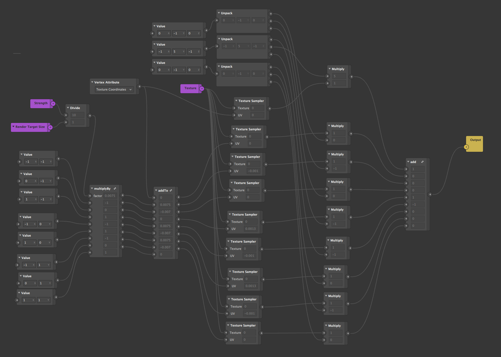

## spark-convolve-test

Trying to solve some issues with the convolution patch.

https://github.com/positlabs/spark-convolution-patch

- texture transforms don't work after convolution
- texture sampling doesn't work after convolution

